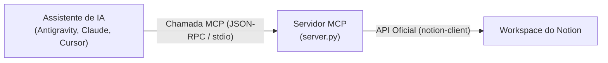

# Notion MCP Server

Servidor [Model Context Protocol (MCP)](https://modelcontextprotocol.io/) que conecta assistentes de inteligência artificial (como Antigravity, Claude Desktop, Cursor, VS Code, etc.) diretamente ao seu espaço de trabalho no **Notion**.

---

## 🧠 Como Funciona?

O MCP é um padrão aberto que transforma integrações externas em ferramentas nativas (*tools*) para a IA. Em vez de a IA tentar fazer requisições manuais ou exigir que você copie e cole dados, ela executa chamadas estruturadas diretamente para este servidor.



1. **Entrada do Usuário**: Você pede algo à IA (ex: *"Busque minhas anotações sobre o projeto X"* ou *"Adicione uma tarefa no Notion"*).
2. **Execução da Ferramenta**: A IA seleciona a ferramenta adequada do servidor MCP e envia os parâmetros via `stdio` (JSON-RPC).
3. **Comunicação com o Notion**: O servidor `server.py` autentica via `NOTION_TOKEN` e executa a operação usando a SDK oficial do Notion (`notion-client`).
4. **Resposta Estruturada**: O servidor retorna o resultado para a IA, que o apresenta de forma formatada para você.

---

## 🛠️ Ferramentas Disponíveis

| Ferramenta | Descrição | Parâmetros |
| :--- | :--- | :--- |
| `search_notion` | Pesquisa por páginas ou bancos de dados no Notion | `query` *(string)*: Termo de busca |
| `create_page_in_db` | Cria uma nova página/registro em um banco de dados | `database_id` *(string)*, `title` *(string)* |
| `append_task` | Adiciona um item de checklist (`to-do`) ao final de uma página | `page_id` *(string)*, `task` *(string)* |

---

## 🚀 Instalação e Configuração

### 1. Clonar o repositório
```bash
git clone https://github.com/EllenRocha1/notion-mcp.git
cd notion-mcp
```

### 2. Instalar dependências
Recomenda-se o uso de um ambiente virtual (`venv`):

```bash
# Criar e ativar o ambiente virtual (opcional)
python -m venv .venv
# No Windows:
.venv\Scripts\activate
# No Linux/macOS:
source .venv/bin/activate

# Instalar dependências
pip install -r requirements.txt
```

### 3. Configurar o Token do Notion
1. Acesse [notion.so/my-integrations](https://www.notion.so/my-integrations) e crie uma nova integração (tipo *Internal*).
2. Copie o **Internal Integration Secret**.
3. Crie um arquivo `.env` na raiz do projeto (use o [`.env.example`](.env.example) como base):
   ```env
   NOTION_TOKEN=secret_seu_token_aqui
   ```
4. **Importante**: No Notion, acesse as páginas ou bancos de dados que deseja manipular, clique nos três pontos (`...`) no canto superior direito > **Conexões (Connections)** > e adicione a sua integração.

---

## ⚙️ Configuração no Cliente MCP (Exemplo: Antigravity / Claude Desktop)

Adicione a configuração no arquivo de configuração do seu cliente MCP:

```json
{
  "mcpServers": {
    "notion": {
      "command": "python",
      "args": ["d:/notion-mcp/server.py"],
      "env": {
        "NOTION_TOKEN": "secret_seu_token_aqui"
      }
    }
  }
}
```

---

## 🔒 Segurança

* O arquivo `.env` está explicitamente incluído no `.gitignore` para prevenir o vazamento acidental de chaves secretas da API do Notion.
* Suas credenciais permanecem exclusivamente no seu ambiente local.